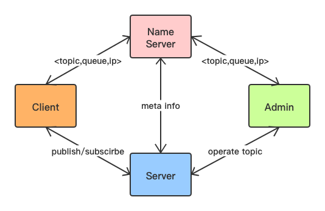

# TinyMQ 

## 整体架构

1. NameServer存储由Server端定时上报的元数据，提供给Client端和Admin端寻址服务。
2. Server端负责存储主题、队列和消息。
3. Client端从NameServer获取相应主题和队列对应的Server的ip地址，从而进行发布消息和订阅消息。
4. Admin端从NameServer获取相应主题和队列对应的Server的ip地址，进行topic的相关管理操作。

## 消息传输协议

消息传输协议简单设计，分为header和body，header包括4个字节的版本号version，16个字节的消息id，4个字节的消息类型，8个字节的当前时间戳；body为`protostuff`序列化后的字节数组。

## 可靠性保证

## todo list

1. 请求体和响应体的设计
2. 获取泛型的参数类型的折中方案
3. 粘包和半包问题netty解法
4. 客户端基于commons-pool池化管理channel
5. 发送端发送消息时加入到缓存，接收到ack应答后才删除消息，或者当1分钟后没收到ack时重试发送，来确保消息不丢失